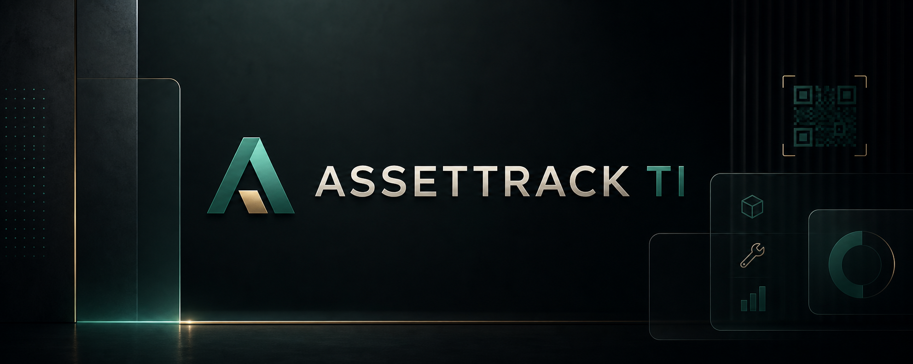

# README - AssetTrack TI



Sistema de Controle de Ativos de TI com backend em Go (Gin + GORM), frontend em React + Vite, PostgreSQL e Redis.

[Manual completo](./docs/MANUAL_DO_USUARIO.md) | [Requisitos do Sistema](./REQUIREMENTS.md) | [Política de Segurança](./SECURITY.md) | [Licença](./LICENSE)

## 📺 Sala de monitoramento e manual online

Após iniciar a aplicação, a equipe pode abrir o [Manual do Sistema](http://localhost:8000/manual) pelo botão de ajuda ou pelo menu lateral. Administradores, gerentes e técnicos também possuem a [Sala de Monitoramento TV](http://localhost:8000/monitoramento), com status de chamados, atribuições, solicitações de ativos, alertas emergenciais, status RH da equipe selecionada, som de notificação e atualização automática a cada 5 segundos.

O painel foi projetado para uso em uma TV: abra a rota, clique em **Tela cheia** e mantenha a sessão autenticada com um perfil operacional.

## ✅ Funcionalidades principais

- **Dashboard:** Indicadores operacionais, atalhos filtrados, comunicados oficiais e notificações por perfil.
- **Ativos & Inventário:** Cadastro, importação/exportação CSV, categorias, localizações, armazenamento, E-Patrimônio, QR Code, histórico e relatórios.
- **Usuários e Perfis:** Gestão de colaboradores, permissões por perfil, avatar, senha, crachá digital e relatórios por usuário.
- **Movimentações:** Solicitação, aprovação, entrega, transferência, devolução e confirmação por QR Code.
- **Service Desk:** Chamados com categoria, prioridade, anexos, timeline, interações, atribuição técnica e dashboard gerencial.
- **Alertas Emergenciais:** Acionamento rápido, transmissão em tempo real, som de alerta, histórico, ciência e atendimento.
- **Comunicados:** Avisos oficiais com texto, imagens, vídeos, links, vigência e exibição no dashboard.
- **Manutenção Corretiva:** Solicitações de reparo, aceite, rejeição, conclusão e confirmação de recebimento.
- **Manutenção Preventiva:** Planos, checklists, ordens, materiais, fotos, notificações e integração com Kanban.
- **Compras:** Solicitações, cotações, pedidos, recebimento, estoque, contratos, centros de custo, produtos, fornecedores e pesquisas.
- **Kanban:** Projetos, colunas, cards, responsáveis, anexos, comentários, favoritos, notificações e vínculo com compras/estoque/preventiva.
- **RH:** Termos de responsabilidade, assinatura, anexos, status da equipe, comunicados, portal do colaborador e seleção para monitoramento.
- **Sala de Monitoramento:** Painel TV com chamados, manutenções, solicitações, Kanban, emergências e status RH selecionado.
- **Android APK:** Download do APK anexado manualmente, QR de instalação, verificação de versão e configuração por endereço único da aplicação.
- **PWA Mobile:** A aplicação web pode ser instalada pelo navegador do smartphone quando acessada pelo endereço da rede, como `http://192.168.x.x:8000`.
- **Administração:** Configurações globais, RBAC de menus, webhooks, backups, restore, logs de e-mail e assistente de IA.

## Estrutura
- **backend/**: API em Go, regras de negócio, modelos GORM e migração automática
- **frontend/**: aplicação React + Vite
- **docker-compose.yml**: ambiente de desenvolvimento com PostgreSQL, Redis, API e Web
- **start_local.ps1 / start_local.sh**: inicialização local nativa do backend e frontend

## 🚀 Como Rodar

O projeto hoje possui dois fluxos principais:

1. **Modo local nativo**: sobe PostgreSQL e Redis via Docker, e roda backend Go + frontend React no host.
2. **Modo Docker completo**: sobe tudo via `docker compose`.

## 💻 Desenvolvimento Local (Recomendado)

### Windows PowerShell

```powershell
./start_local.ps1
```

### Linux / macOS / WSL

```bash
chmod +x start_local.sh
./start_local.sh
```

Esse modo sobe:

- **PostgreSQL** em `localhost:5456`
- **Redis** em `localhost:6380`
- **Backend Go** em `http://localhost:8080`
- **Frontend React/Vite** em `http://localhost:3000`

### Requisitos para o modo local

- Go
- Node.js + npm
- Docker com `docker compose`

### Inicialização manual do modo local

Se preferir rodar por etapas:

```powershell
docker compose up -d db redis
cd backend
go run ./cmd/server
```

Em outro terminal:

```powershell
cd frontend
npm install
npm run dev
```

## 🐳 Docker Completo

Certifique-se de ter Docker e Docker Compose instalados.

Nesse modo:

- **Frontend Web** fica em `http://localhost:8000`
- **API Go** fica em `http://localhost:8080`, mas o frontend acessa a API automaticamente por `/api/v1`
- **Healthcheck da API** fica em `http://localhost:8080/health`

### Endereço único da aplicação

Em instalações Docker, o usuário deve abrir somente o endereço da aplicação web:

```text
http://IP_DO_SERVIDOR:8000
```

O container web faz proxy interno para a API em `/api/v1`, `/uploads` e `/health`. Assim, a tela de login não precisa ser configurada com `http://IP_DO_SERVIDOR:8080/api/v1`.

No APK Android, quando for necessário configurar o servidor, informe também apenas o endereço da aplicação:

```text
http://IP_DO_SERVIDOR:8000
```

O aplicativo completa automaticamente o caminho da API para `/api/v1`.

### 1. Inicialização Rápida (Automação)
O projeto inclui um script que configura o ambiente, sobe os containers e inicializa o usuário administrador automaticamente:

```bash
chmod +x init_docker.sh
./init_docker.sh
```

O ambiente Web local usa `http://localhost:8000` e o Nginx encaminha `/api/v1` internamente para a API. O fluxo local não depende do perfil ZimaOS nem deve apontar o frontend diretamente para a porta 8080.

### ⚙️ Utilitários de Gestão
Para facilitar a manutenção, você pode usar os seguintes scripts:

*   **Parar aplicação:**
    ```bash
    ./stop_docker.sh
    ```
*   **Atualizar aplicação (Git Pull + Rebuild):**
    ```bash
    ./update_docker.sh
    ```

### 🔄 Atualizar a aplicação na VM

Para baixar automaticamente as mudanças do GitHub e reconstruir os containers, execute na VM:

```bash
cd /caminho/assettrack_ti
git pull --ff-only
bash update_docker.sh
```

O script atualiza a API e o frontend e reinicia os serviços. Se os scripts ainda não tiverem permissão de execução:

```bash
chmod +x *.sh scripts/*.sh
./update_docker.sh
```

Para conferir o estado após a atualização:

```bash
docker compose ps
curl http://localhost:8080/health
```

Em uma VM acessada por outros dispositivos, utilize o endereço IP da VM exibido pelo instalador e libere a porta `8000` no firewall. A porta `8080` só precisa ser exposta se você quiser acessar a API diretamente para testes ou integrações.

### 🆕 Instalação inicial na VM

Na primeira instalação, execute dentro da pasta do projeto:

```bash
git pull
cp .env.example .env
chmod +x init_docker.sh scripts/*.sh
./init_docker.sh
```

O instalador cria a configuração local, constrói a API, o frontend, o banco e o Redis, executa as migrações e inicia a aplicação.

O APK Android não é mais gerado pela aplicação nem pelos scripts de instalação/atualização. Gere o arquivo via terminal e anexe-o ao portal de download com:

```bash
./scripts/publish_mobile_apk.sh /caminho/AssetTrack-TI.apk
```

### 2. Inicialização Manual
Caso prefira rodar os comandos passo a passo:

1.  **Configurar ambiente:**
    ```bash
    cp .env.example .env
    ```
2.  **Subir os containers:**
    ```bash
    docker compose up -d --build
    ```
3.  **Acesse o sistema:**
    - Frontend Web: [http://localhost:8000](http://localhost:8000)
    - API via web/proxy: [http://localhost:8000/api/v1](http://localhost:8000/api/v1)
    - API direta: [http://localhost:8080](http://localhost:8080)
    - Healthcheck da API: [http://localhost:8080/health](http://localhost:8080/health)

---

## 🔑 Usuários Padrão

Credenciais sugeridas para teste:

| Perfil | Email | Senha | Acesso |
| :--- | :--- | :--- | :--- |
| **Admin** | `admin@example.com` | `admin` | Total (Configurações, Usuários, Ativos) |
| **RH** | `rh@example.com` | `123` | Emissão e gestão de Termos de Responsabilidade |
| **Técnico** | `tecnico@example.com` | `123` | Operacional (Manutenções e Devoluções) |

### Gerenciar usuários via terminal (Docker)
Hoje, o usuário administrador padrão é criado automaticamente no startup da API Go quando ainda não existe. Se você precisar inspecionar manualmente o container web, pode usar:

```bash
# Exemplo de acesso ao container web legado
docker compose exec web sh
```

---

## 🏢 Gestão de Fornecedores e Notas Fiscais

O sistema possui um módulo completo para controle e relacionamento de Fornecedores e Notas Fiscais de Ativos.

| Recurso | Descrição |
| :--- | :--- |
| **Cadastro de Fornecedores** | Registro de dados (Razão Social, CNPJ, Contato, Endereço e Tipo) |
| **Integração XML** | Upload de Notas Fiscais em formato `.xml` |
| **Vínculo com Ativos** | Seleção de fornecedor no cadastro de novos ativos |
| **Rastreabilidade** | Vínculo automático de Nota Fiscal ao fornecedor |
| **Upload de Imagens** | Foto/comprovante do equipamento no servidor |

## 📊 Relatórios de Ativos (`/assets`)

Os relatórios e filtros de ativos ficam integrados na própria tela de inventário, com exportação em CSV pelo frontend consumindo a API.

| Recurso | Descrição |
| :--- | :--- |
| **Filtros Combinados** | Data início/fim, nome do ativo, categoria, localização, fornecedor, número de NF e E-Patrimônio. |
| **Painel Integrado** | O painel de filtros fica na própria página de Ativos & Inventário, sem depender de rota separada. |
| **Exportação CSV** | Exportação dos resultados filtrados via endpoint `/api/v1/assets/export.csv`. |

## 🎧 Service Desk (Help Desk)

Módulo integrado e moderno para gestão de chamados de suporte técnico.

| Recurso | Descrição |
| :--- | :--- |
| **Abertura de Chamados** | Relato de problemas por categorias e setores com suporte a upload de imagens de identificação. |
| **Painel de Gráficos (Chart.js)** | Dashboard analítico premium (distribuição por status, prioridades, categorias e top solicitantes) restrito a Administradores e Gerentes. |
| **Filtros Avançados de Busca** | Filtros posicionados estrategicamente abaixo dos gráficos para pesquisa refinada por texto, status, categoria, prioridade e intervalo de datas. |
| **Timeline Interativa** | Histórico cronológico completo de interações com suporte a fotos tanto para técnicos quanto para solicitantes (reforço visual dos serviços). |
| **Formato Profissional de Código** | Chamados gerados em formato estruturado (Ex: `CH-2026-0001`), com links permanentes amigáveis para organização. |
| **QR Code do Chamado** | Código QR gerado automaticamente e impresso acima do código do chamado para acesso e acompanhamento mobile rápido. |
| **Fuso Horário Local Preciso** | Registro de abertura e interações ajustado perfeitamente ao fuso horário `America/Sao_Paulo` (UTC-3). |

## 🚨 Alertas de Emergência em Tempo Real

Sistema de notificação de alta prioridade para chamados de emergência de TI e infraestrutura.

| Recurso | Descrição |
| :--- | :--- |
| **Botão de Emergência** | Botão destacado no dashboard de usuários comuns para abertura instantânea de chamados urgentes. |
| **Transmissão SSE (Server-Sent Events)** | Transmissão de alertas sem atraso e sem necessidade de recarregar a página (`/emergencia/stream`). |
| **Aviso Sonoro de Notificação** | Emissão automática de áudio de alerta (`notificacao_alerta.mp3`) para a equipe de atendimento (Admin, Gerente, Técnico). |
| **Banner e Contadores no Dashboard** | Exibição de contadores ao vivo (`Total Recebidos` e `Pendentes`) no painel da equipe staff. |
| **Histórico e Atendimento de Alertas** | Modal interativo com filtros por status (Todos/Pendentes/Atendidos) e botão para marcar como "Atendido", vinculando o responsável técnico. |

## 📢 Comunicados & Avisos Oficiais do Sistema

| Recurso | Descrição |
| :--- | :--- |
| **Suporte Multimídia Completo** | Publicação de avisos por administradores, gerentes e técnicos com uploads diretos de imagens e vídeos (MP4/WEBM) ou links de streaming (YouTube/Vimeo). |
| **Exibição na Dashboard** | Seção em destaque no topo da Dashboard para todos os perfis com polling de 15s. |
| **Modal Interativo em Tela Cheia** | Player de vídeo integrado, galeria de imagens em alta resolução e texto completo. |

## 📱 Aplicativo Android (Capacitor) & Arquitetura Offline-First

| Recurso | Descrição |
| :--- | :--- |
| **Operação Offline-First** | Fila de mutações gravada no armazenamento local (`localStorage`), permitindo que a equipe trabalhe mesmo sem sinal. |
| **Sincronização Automática** | Auto-envio de pendências ao reconectar à rede com notificação visual (toast). |
| **Botão & Modal de Download do APK** | Botão em destaque na versão web com download direto do APK versionado, QR Code para celulares e guia de 3 passos. |
| **Notificador de Novas Versões** | Verificação em segundo plano alertando sobre atualizações disponíveis do aplicativo. |

## 📱 Sistema de QR Code

Funcionalidades de identificação, login rápido e acompanhamento ágil.

| Recurso | Descrição |
| :--- | :--- |
| **Crachá Digital** | QR Code único por usuário. |
| **Login via QR** | Login rápido via QR + PIN. |
| **Acompanhamento de Chamados** | QR Code impresso nos chamados vinculando ao link direto de atendimento mobile (`/servicos/chamado/CH-2026-0001`). |
| **Histórico de Ativos** | Scanner revela histórico completo de movimentação (E-Patrimonio). |

> 📸 **Nota sobre Scanner via Rede Local (HTTP):**
> Navegadores bloqueiam a câmera em conexões HTTP. Para liberar em sua rede local:
> 1. No Chrome/Edge, acesse: `chrome://flags/#unsafely-treat-insecure-origin-as-secure`
> 2. Em "Insecure origins treated as secure", adicione o endereço do frontend que você estiver usando:
>    `http://SEU_IP:3000` no modo local nativo
>    `http://SEU_IP:8000` no modo Docker completo
> 3. Mude para **Enabled** e reinicie o navegador.

---

## 🔧 Manutenção Preventiva (CMMS/EAM)

Módulo completo para gestão de manutenção preventiva, corretiva e periódica integrado ao AssetTrack TI.

| Recurso | Descrição |
| :--- | :--- |
| **Planos de Manutenção** | Registro de planos periódicos, definindo tipo (Preventiva/Preditiva/Inspeção/Calibração), periodicidade, criticidade e prioridade. |
| **Ordens de Serviço** | Criação manual ou automática de ordens de manutenção (OS), com histórico de execução e acompanhamento de status em tempo real. |
| **Checklists de Manutenção** | Cadastro de itens de verificação obrigatórios para cada tipo de manutenção. |
| **Histórico Completo** | Auditoria completa de todas as ações, incluindo execução de checklists, fotos e materiais utilizados. |
| **Dashboard Analítico** | Painel com métricas (manutenções vencidas/hoje/semana), gráficos (Preventiva vs Corretiva, status das ordens, ordens por técnico) e próximas manutenções agendadas. |
| **Geração Automática de Códigos** | Planos no formato `PLAN-ANO-NÚMERO` e ordens no formato `OS-ANO-NÚMERO`. |
| **Integração com Ativos** | Vinculação de ativos aos planos e ordens, com histórico completo. |
| **Segurança por Permissões** | Acesso controlado por perfis: Admin, Gerente, Técnico, Usuário. |

## 🛒 Módulo de Compras (Procurement)

Sistema completo de suprimentos integrado ao AssetTrack TI, permitindo ciclo ponta a ponta desde a requisição até o recebimento.

| Recurso | Descrição |
| :--- | :--- |
| **Solicitações de Compra (SC)** | Geração de requisições com status dinâmicos, suporte a pré-preenchimento via integrações e aprovação de gerência. |
| **Cotações e Fornecedores** | Lançamento de comparativos de preço, escolha do vencedor e integração direta com o módulo de Fornecedores. |
| **Ordens de Compra (PO)** | Emissão de Pedidos de Compra oficiais, controle de orçamento por Centro de Custo e acompanhamento de status. |
| **Recebimento e Estoque** | Entrada de notas fiscais, atualização automática de estoque de peças e inserção automatizada de novos Ativos no patrimônio. |
| **Gestão de Contratos** | Controle de vigência, alertas visuais (30/60/90 dias) e upload de PDFs e aditivos contratuais. |
| **Integrações (Atalhos)** | Botão "Solicitar Compra" disponível diretamente nas interfaces de Manutenção Preventiva e Service Desk. |
| **Exportação CSV** | Download de relatórios gerenciais e dados do módulo diretamente em formato CSV. |

---

## 📋 Kanban (Projetos Internos)

Módulo visual estilo Trello para gestão ágil de projetos, iniciativas e tarefas da equipe de TI.

| Recurso | Descrição |
| :--- | :--- |
| **Quadros Customizáveis** | Criação de projetos com colunas flexíveis (ex: Backlog, Em Andamento, Concluído). |
| **Gestão de Tarefas (Cards)** | Cards detalhados com descrição Markdown, prioridade, data de entrega e responsáveis. |
| **Integração Drag & Drop** | Mova cards entre colunas com atualização instantânea de progresso em tempo real. |
| **Métricas de Progresso** | Barra de progresso global calculada automaticamente pela posição dos cards nas colunas. |
| **Vinculação de Ativos** | Associação de múltiplos equipamentos (E-Patrimônio) diretamente a um card. |
| **Integração com Suprimentos** | Vinculação de tarefas a Solicitações de Compra ou retiradas do Estoque. |
| **Notificações em Tempo Real** | Feed de andamentos integrado ao Dashboard informando movimentações de forma dinâmica. |

---

## 🤝 Recursos Humanos (RH) e Termos de Responsabilidade

Módulo dedicado à emissão e controle legal da entrega de ativos aos colaboradores.

| Recurso | Descrição |
| :--- | :--- |
| **Emissão de Termos** | Geração automática de Termos de Responsabilidade (PDF) a partir de solicitações de ativos concluídas. |
| **Gestão de Aceite** | Controle do status de assinatura pelo colaborador (Pendente/Assinado). |
| **Armazenamento Seguro** | Upload do documento físico digitalizado (PDF ou Imagem) diretamente no sistema. |
| **Status da Equipe** | Controle visual de colaboradores trabalhando, de folga, em férias, desligados ou em banco de horas. |
| **Seleção para Monitoramento** | O RH escolhe quais colaboradores aparecem na Sala de Monitoramento, com avatar, primeiro nome, status atual e horas quando aplicável. |
| **Visão Simplificada** | Usuários do perfil `RH` enxergam uma interface amigável e restrita (similar ao usuário comum), sem os menus técnicos complexos da TI. |

---

## 🎛️ Gerenciador de Módulos e Controle de Acessos (RBAC Dinâmico)

O sistema possui uma arquitetura modular e flexível que permite ao administrador gerenciar tanto os recursos globais quanto as permissões específicas de visualização de menus por perfil, diretamente pela interface e em tempo real:

- **Habilitação de Recursos Globais:** Ativação/desativação sob demanda dos módulos de **Manutenção Preventiva** e **Compras**, ocultando rotas e menus associados.
- **Controle de Acessos por Menu (Matriz RBAC):** Uma grade de controle onde o administrador define quais perfis de acesso (`ADMIN`, `GERENTE_TI`, `GERENTE_INFRA`, `TECNICO`, `COMPRADOR`, `RH`, `USUARIO_COMUM`) podem visualizar e acessar cada menu da aplicação (`Ativos`, `Fornecedores`, `Manutenção`, `Tickets`, `Compras`, `Termos RH`, `Relatórios`, `Usuários`, `Backup`).
- **Trava de Segurança:** O perfil `Administrador` possui permissões garantidas e travadas para leitura em todos os módulos, evitando bloqueios acidentais.
- **Acesso:** Tela administrativa em `/configuracoes`, integrada ao frontend React e à API `/api/v1/admin/settings`.

---

## 🛠️ Segurança e Auditoria

- 🔒 **Rate Limiting**: Proteção contra força bruta nos logins.
- ⏰ **Expiração**: Tokens QR configuráveis.
- 🔐 **PIN**: Obrigatório para ações via QR Code.
- 📝 **Logs**: Registro completo de movimentações e logins.
